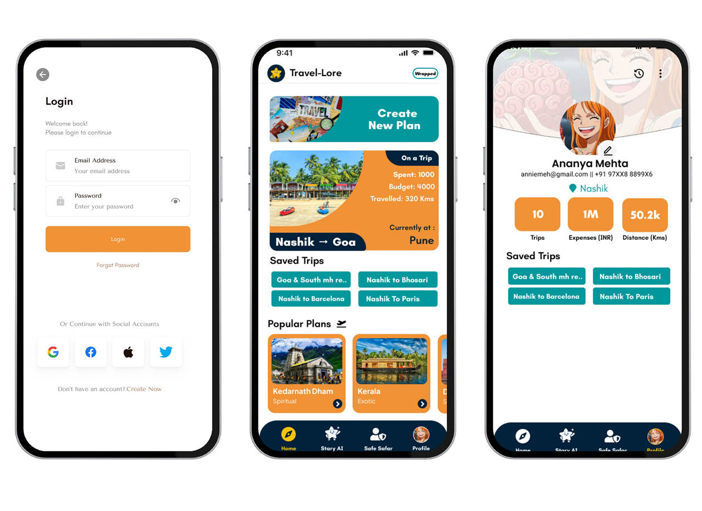

# ✈️ TravelLore – UX Case Study Website

Live Site 👉 [https://travellore-case-study.vercel.app](https://travellore-case-study.vercel.app)

A storytelling case study website that documents the user experience process of TravelLore – a concept travel app focused on **self-discovery and solo-travel safety** for Gen Z. This site showcases research, personas, problems, journey, screens, and more in a clean, responsive UI.

---

## 🖼️ Preview



---

## 📁 Sections Covered

- 🌟 Hero / Header
- 👥 Team Introduction
- 🧩 Problem Statement
- ✈️ User Journey
- 🔬 Research & Personas
- 📊 Analysis (Affinity Map, Empathy Map, User Flow)
- 📱 Screens Showcase
- 📝 Final Thoughts & CTA

---

## ⚙️ Tech Stack

- React.js (Vite)
- HTML / CSS (Custom, responsive)
- Vercel (Deployment)
- Git & GitHub (Version Control)

---

## 🚀 How to Run Locally

```bash
git clone https://github.com/imshivraj101/TravelLore_Case_Study.git
cd TravelLore_Case_Study
npm install
npm run dev
